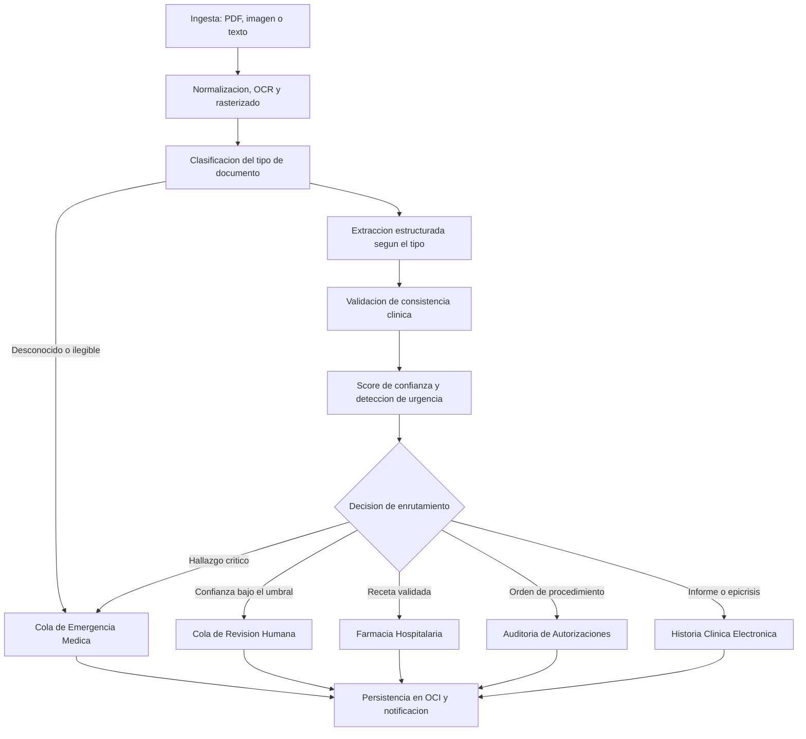

# MediFlow

Sistema inteligente para el procesamiento, clasificación, extracción y triaje automatizado de documentos clínicos.

**Hackathon ONE G10 — Oracle Next Education & Alura · Proyecto 2 · Equipo 46 (LATAM)**

[Plan de ejecución de las cinco semanas](https://no-country-simulation.github.io/G10-LATAM-EQUIPO-46-MediFlow/) · [Contrato de la API](docs/CONTRATO.md) · [Cómo trabajamos](CONTRIBUTING.md)

---

## El problema

Hospitales, laboratorios y aseguradoras de salud pierden miles de horas con equipos
administrativos leyendo manualmente informes y recetas para transcribir datos en
sistemas heredados. Además de lento y costoso, el proceso manual está sujeto a errores
de tipeo y a demoras en la atención de pacientes con cuadros de urgencia.

Un informe de tromboembolismo pulmonar que espera tres días en una bandeja no es un
problema administrativo. Es un problema clínico.

## La solución

Un agente autónomo que recibe un documento clínico en PDF, imagen o texto, lo
clasifica, extrae los datos clínicos esenciales, evalúa su confianza y su urgencia, y
lo enruta al destino correcto: sin intervención humana en los casos estándar, y
escalando a un auditor humano cuando hay ambigüedad.

**Dos reglas que no se negocian.** Primera: ante cualquier duda, fallo del modelo o
documento ilegible, el caso escala a una persona; nunca a aprobación automática.
Segunda: si un dato no está en el documento, el campo va en `null` y baja la
confianza. Un código CIE-10 inventado es peor que un campo vacío.

## Grafo de decisión del agente



## Arquitectura General

* Frontend
* Backend
* Agente IA
* OCI Object Storage

## Módulos del Proyecto

* **`agente/`**: Inteligencia artificial y procesamiento documental.
* **`backend/`**: API y lógica de integración.
* **`frontend/`**: Interfaz de usuario.
* **`infrastructure/`**: Infraestructura y servicios cloud.
* **`docs/`**: Plan de ejecución, contrato de la API y documentación del proyecto.

## Contrato de la API

El sistema expone un endpoint de triaje que recibe un documento y devuelve la
clasificación, los datos extraídos y la decisión de enrutamiento.

La definición completa, con los valores admitidos de cada campo y las reglas de
forma, está en **[docs/CONTRATO.md](docs/CONTRATO.md)**. Ese documento manda sobre
cualquier otra definición del repositorio.

## Organización del bucket en OCI Object Storage

Un único bucket Always Free, segregado por estado del documento:

```
mediflow-documentos-clinicos/
  recibidos/                  documento original, tal como llego
  procesados/
    rutina/                   confianza alta, ruta automatica
    urgentes/                 hallazgo critico o prioridad urgente
  auditoria_humana/           confianza baja o documento ambiguo
```

Un documento que entra por `recibidos/` termina siempre en exactamente uno de los
otros tres prefijos. Si un objeto queda solo en `recibidos/`, es que el flujo se
cortó y hay que investigarlo.

## Stack

| Capa                  | Tecnología                          |
|-----------------------|-------------------------------------|
| Lenguaje              | Python                              |
| Modelo de lenguaje    | Google Gemini                       |
| Orquestación          | LangChain / LangGraph               |
| Validación de datos   | Pydantic                            |
| Pruebas               | Pytest                              |
| API                   | *(a confirmar: FastAPI o Flask)*    |
| Interfaz de triaje    | *(a confirmar: Streamlit o Gradio)* |
| Almacenamiento        | OCI Object Storage, capa Always Free |

## Ejecución

El módulo del agente tiene su propia guía de instalación y ejecución:
**[agente/README.md](agente/README.md)**.

> **Nunca subas el archivo `.env`.** Cada quien crea el suyo a partir de
> `agente/.env.example` con su propia clave.

## Estado del Proyecto

Actualmente se encuentra en desarrollo el **Sprint 1** del módulo **Agent**.

El plan completo de las cinco semanas, con las tres entregas de cada una y el
reparto entre los dos equipos, está en la
**[página del plan de ejecución](https://no-country-simulation.github.io/G10-LATAM-EQUIPO-46-MediFlow/)**.

| Semana | Fechas          | Hito                      |
|--------|-----------------|---------------------------|
| 1      | 21 al 27 sep    | Esqueleto vivo            |
| 2      | 28 sep al 4 oct | Lee cualquier formato     |
| 3      | 5 al 11 oct     | El agente decide          |
| 4      | 12 al 18 oct    | Producto y panel humano   |
| 5      | 19 al 25 oct    | Entrega                   |

Fecha límite de entrega: **27 de octubre de 2026**.

## Los tres escenarios de la demostración

El enunciado exige demostrar al menos tres casos distintos. Los usamos además como
prueba de aceptación en cada sprint.

1. **Flujo estándar aprobado.** Orden de estudio de laboratorio ambulatoria, legible
   y completa. Confianza alta, ruta automática a Auditoría de Autorizaciones, objeto
   en `procesados/rutina/`.
2. **Prioridad de urgencia médica.** El informe de tromboembolismo pulmonar del
   enunciado. Prioridad urgente, ruta a Cola de Emergencia Médica, notificación al
   canal de guardia, objeto en `procesados/urgentes/`.
3. **Caso ambiguo derivado a auditoría humana.** Foto de receta manuscrita con la
   dosis ilegible. Confianza baja, campos en `null`, ruta a Cola de Revisión Humana,
   objeto en `auditoria_humana/`. El auditor corrige, aprueba, y el documento sigue
   hacia Farmacia.

## Equipo

Ocho personas repartidas en dos frentes de cuatro.

**Equipo A, agente e inteligencia.** Todo lo que ocurre entre que llega un documento
y sale una decisión: ingesta, clasificación, extracción, confianza, urgencia y grafo
de enrutamiento.

**Equipo B, plataforma y producto.** Todo lo que rodea al agente: API,
almacenamiento en OCI, interfaz de triaje, panel de auditoría, pruebas,
documentación y demostración.

| Nombre | GitHub | Equipo |
|--------|--------|--------|
| *(completar)* | *(completar)* | A |
| *(completar)* | *(completar)* | A |
| *(completar)* | *(completar)* | A |
| *(completar)* | *(completar)* | A |
| *(completar)* | *(completar)* | B |
| *(completar)* | *(completar)* | B |
| *(completar)* | *(completar)* | B |
| *(completar)* | *(completar)* | B |

## Enlaces del proyecto

| Recurso                  | Enlace |
|--------------------------|--------|
| Repositorio              | https://github.com/No-Country-simulation/G10-LATAM-EQUIPO-46-MediFlow |
| Plan de ejecución        | https://no-country-simulation.github.io/G10-LATAM-EQUIPO-46-MediFlow/ |
| Tablero de trabajo       | *(completar)* |
| Video demo               | *(completar, semana 5)* |
| Despliegue               | *(completar)* |

## Datos y Descargo de Responsabilidad

El prototipo utiliza **datos ficticios** para las pruebas. **No debe utilizarse bajo ninguna circunstancia como sustituto de una evaluación, diagnóstico o decisión médica profesional.**

Los documentos de `agente/examples/` no contienen información real de pacientes. No
subas al repositorio ningún documento clínico real, ni siquiera anonimizado.
