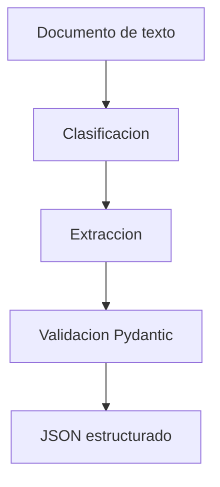

# MediFlow Agent

Módulo de inteligencia artificial encargado del procesamiento y análisis de documentos clínicos para el proyecto MediFlow.

## Sprint 1

El primer sprint implementa el núcleo inicial del agente mediante el siguiente flujo secuencial:



El grafo de decisión completo, con el enrutamiento a los cinco destinos, está en
el [README de la raíz](../README.md#grafo-de-decisión-del-agente). Este diagrama
muestra solo lo que el Sprint 1 implementa hoy.

## Tecnologías

* **Python** (Núcleo del desarrollo)
* **Gemini** (Modelo de Lenguaje / LLM)
* **LangChain / LangGraph** (Orquestación del Agente)
* **Pydantic** (Validación de estructuras de datos)
* **Pytest** (Pruebas unitarias y automatizadas)

## Categorías de Clasificación

Actualmente el clasificador reconoce estrictamente las siguientes categorías de documentos:

* receta_medica
* informe_estudio_diagnostico
* orden_procedimiento
* epicrisis
* certificado_medico
* desconocido

## Guía de Ejecución

Sigue estos pasos en la terminal para configurar y correr el agente localmente:

### 1. Crear y activar el entorno virtual
```bash
python -m venv .venv

# En PowerShell:
.\.venv\Scripts\Activate.ps1

# En CMD clásico de Windows:
.\.venv\Scripts\activate.bat
```

### 2. Instalar dependencias
```bash
pip install -r requirements.txt
```

### 3. Configurar variables de entorno
Crea un archivo llamado `.env` en la raíz de este módulo y define tus credenciales:
```env
GEMINI_API_KEY=TU_API_KEY
GEMINI_MODEL=gemini-2.5-flash
```

### 4. Ejecutar el agente
Para correr el script principal, debes indicarle a Python dónde encontrar el código fuente. Elige el comando según tu terminal:

* **En CMD (Símbolo del sistema):**
  ```cmd
  set PYTHONPATH=src&& python -m mediflow_agent.main examples/informe.txt
  ```
* **En PowerShell:**
  ```powershell
  $env:PYTHONPATH="src"
  python -m mediflow_agent.main examples/informe.txt
  ```

### 5. Levantar la API de triaje

```bash
uvicorn mediflow_agent.api.app:app --reload --app-dir src
```

Queda en `http://127.0.0.1:8000`. La documentación interactiva está en
`http://127.0.0.1:8000/docs`: desde ahí se puede pegar el JSON del enunciado y
ver la respuesta completa sin escribir una sola línea de código.

Dos endpoints:

| Método | Ruta | Para qué |
|--------|------|----------|
| `GET`  | `/salud` | Comprobar que el servicio está arriba. No llama al modelo ni gasta cuota. |
| `POST` | `/triaje` | Documento en **texto**. Cuerpo JSON. |
| `POST` | `/triaje/archivo` | Documento en **PDF o imagen**. Subida multipart. |

Los dos devuelven exactamente la misma respuesta: el formato de entrada no
cambia nada de lo que recibe el consumidor.

#### Qué formatos lee

| Entra | Cómo se lee |
|-------|-------------|
| Texto plano | Directo. |
| PDF nativo | Capa de texto del PDF. No gasta cuota del modelo. |
| PDF escaneado | Se rasterizan las páginas y las transcribe el modelo multimodal. |
| Imagen (foto, captura) | Se normaliza y la transcribe el modelo multimodal. |

Se usa Gemini multimodal en vez de un OCR tradicional, como sugiere el
enunciado. Eso evita depender de Tesseract, que en Windows es una instalación
externa aparte.

El caso peligroso está contemplado: un PDF con una **capa de texto pobre** —un
escaneo al que alguien le pasó un OCR malo— parece éxito y no lo es. Se detecta
por densidad de caracteres por página y se transcribe igual.

Prueba rápida con el caso del enunciado:

```bash
curl -X POST http://127.0.0.1:8000/triaje ^
  -H "Content-Type: application/json" ^
  -d "{\"documento_id\":\"DOC-CLIN-2026-8942\",\"tipo_archivo\":\"TEXTO\",\"documento_texto\":\"CONCLUSION: Cuadro compatible con Tromboembolismo Pulmonar Agudo.\",\"canal_origen\":\"Guardia_Emergencias\"}"
```

El formato exacto de entrada y salida está en
[`docs/CONTRATO.md`](../docs/CONTRATO.md).

#### Dónde se guardan los documentos

Mientras no exista el bucket de OCI (tarea 1.2), la persistencia va a disco con
**exactamente la misma estructura de prefijos** que tendrá el bucket:

```
.almacen/
  recibidos/              el documento tal como llego
  procesados/rutina/      confianza alta, ruta automatica
  procesados/urgentes/    hallazgo critico o prioridad urgente
  auditoria_humana/       confianza baja o documento ambiguo
```

Para usar OCI Object Storage, que es lo que exige el enunciado, se cambia una
variable:

```env
MEDIFLOW_ALMACEN=oci
MEDIFLOW_BUCKET=nombre-del-bucket
```

y se completan las credenciales de OCI del `.env.example`. Ni el endpoint ni el
servicio se enteran de cuál de los dos almacenes está en uso.

#### Verificar la conexión con OCI

```bash
python scripts/verificar_oci.py
```

Sube un objeto de prueba a los cuatro prefijos, lo vuelve a leer y compara el
contenido. Es la prueba de subida y descarga que pide la tarea 1.2. Si algo
falla, dice qué revisar en lugar de mostrar una traza.

#### Obtener las credenciales

En la consola de OCI: **perfil → My profile → API keys → Add API key**. Al
generarla, OCI muestra un bloque de configuración con el OCID del usuario, el
de la tenancy y el fingerprint, y descarga un archivo `.pem` con la clave
privada.

> **El `.pem` nunca va al repositorio.** El `.gitignore` lo bloquea, pero la
> red de seguridad no reemplaza mirar tu propio `git diff`.

Dos variables opcionales:

```env
MEDIFLOW_ALMACEN_LOCAL=.almacen
MEDIFLOW_BUCKET=mediflow-documentos-clinicos
MEDIFLOW_UMBRAL_CONFIANZA=0.70
```

### Ejecución de las Pruebas Unitarias

```bash
python -m pytest
```

`pytest.ini` ya pone `src/` en la ruta de importación, así que no hace falta
exportar `PYTHONPATH` a mano.

Las pruebas **no llaman a Gemini**: el modelo se sustituye por dobles. Corren
en menos de un segundo y no consumen cuota, que es la contramedida al riesgo
de quedarse sin llamadas gratuitas a mitad de la semana.

## Reglas Importantes del Agente

Para garantizar la seguridad y fiabilidad clínica, el comportamiento del Agente está blindado bajo las siguientes reglas:

1. **Evidencia estricta:** Extraer solamente información explícitamente disponible en el documento.
2. **Uso de nulos:** Utilizar `null` (`None`) cuando un dato no esté disponible en el texto.
3. **Cero alucinaciones:** No inventar ni inferir información clínica que no esté firmada por el médico.
4. **Validación estricta:** Validar los tipos y límites de todas las estructuras mediante Pydantic (ej. confianza entre 0 y 1).
5. **Alcance de Codificación:** Tratar `suggested_icd10` únicamente como una sugerencia automatizada y jamás como un diagnóstico definitivo.

